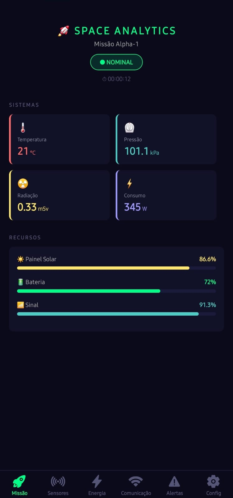
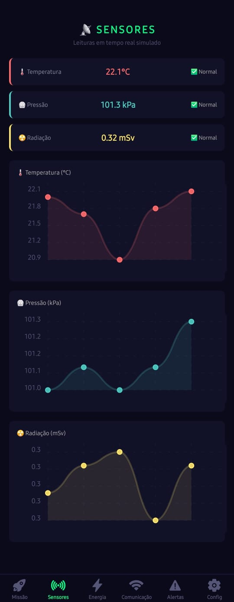
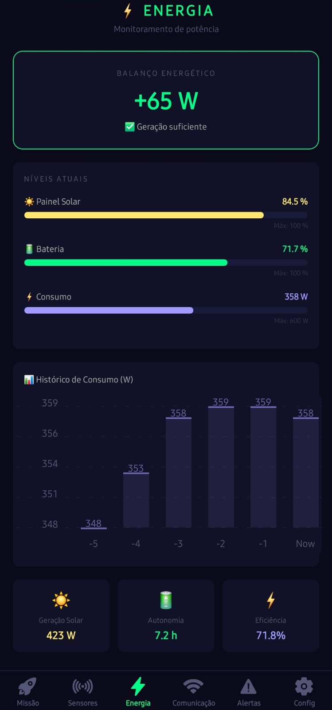
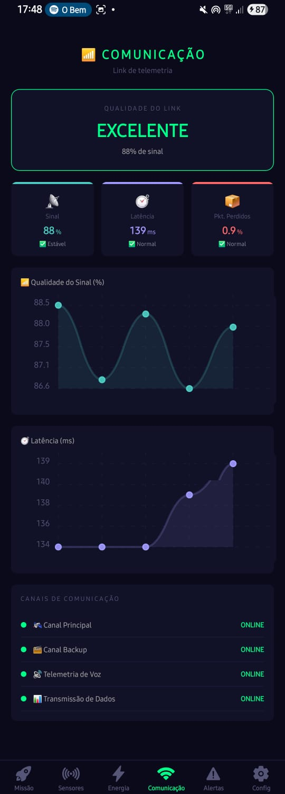
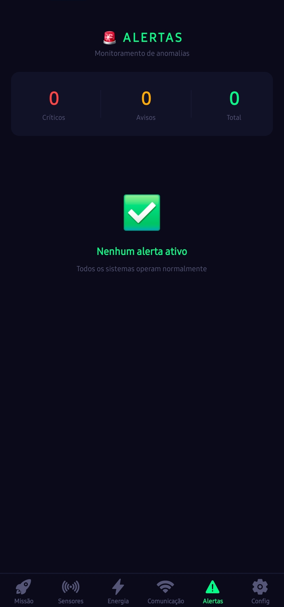
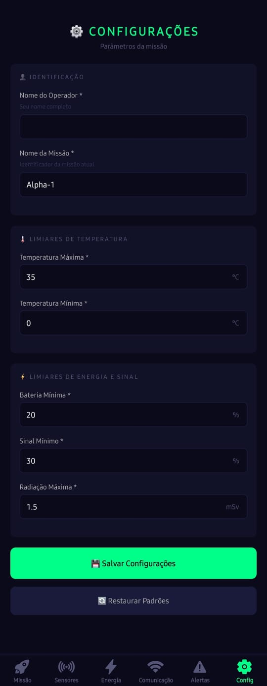

# 🚀 Space Analytics
### Global Solution 2026.1 — Cross-Platform Application Development | FIAP

---

## 📋 Descrição

O **Space Analytics** é uma plataforma mobile de análise preditiva para monitoramento de sistemas espaciais e operações orbitais simuladas. O app coleta, organiza e processa dados de sensores, energia, comunicação e estabilidade orbital em tempo real simulado, gerando alertas automáticos quando valores ultrapassam limiares críticos e permitindo ao operador configurar os parâmetros da missão.

---

## 👥 Equipe

| Nome | RM |
|------|----|
| Mateus Patricio Pereira | RM564695 |
| Carlos Eduardo Pires Cervelli | RM563462 |

---

## 📱 Telas do Aplicativo

### 🚀 Missão — Dashboard Principal

Visão geral dos indicadores da missão: status operacional, timer, temperatura, pressão, radiação, consumo, barras de recursos e últimos alertas.

### 📡 Sensores

Gráficos de linha com leituras em tempo real simulado de temperatura, pressão e radiação.

### ⚡ Energia

Balanço energético, níveis de painel solar e bateria, histórico de consumo e indicadores de eficiência.

### 📶 Comunicação

Qualidade do link de telemetria, latência, pacotes perdidos, gráficos em tempo real e status dos canais.

### 🚨 Alertas

Lista de alertas gerados automaticamente com nível de criticidade. Permite dispensar alertas individualmente ou limpar todos.

### ⚙️ Configurações

Formulário de configuração dos limiares de alerta com validação e persistência local via AsyncStorage.

---

## ✅ Funcionalidades

- [x] Dashboard principal com indicadores em tempo real simulado
- [x] Dashboard de sensores com gráficos de linha (temperatura, pressão, radiação)
- [x] Dashboard de energia com gráfico de barras e balanço energético
- [x] Dashboard de comunicação com qualidade de link e status dos canais
- [x] Sistema de alertas automáticos por limiar crítico
- [x] Persistência de configurações com AsyncStorage
- [x] Navegação com Expo Router (Tabs)
- [x] Context API para estado global da missão
- [x] Formulário de configuração com validação completa

---

## 🛠️ Tecnologias

- React Native + Expo SDK 54
- Expo Router
- AsyncStorage
- Context API
- react-native-chart-kit
- react-native-svg
- Ionicons (@expo/vector-icons)

---

## ▶️ Como Executar

### Pré-requisitos
- Node.js instalado
- Expo Go instalado no celular (iOS ou Android)

### Instalação

```bash
# Clone o repositório
git clone https://github.com/Matttpereira/space-analytics

# Acesse a pasta
cd space-analytics

# Instale as dependências
npm install

# Inicie o projeto
npx expo start
```

Escaneie o QR Code com o Expo Go para rodar no dispositivo físico.

---

## 🎥 Vídeo de Demonstração

[Clique aqui para assistir à demonstração](https://youtube.com/shorts/ban_zNNyebU)

---

## 📄 Licença

Este projeto foi desenvolvido para fins acadêmicos — FIAP 2026.
